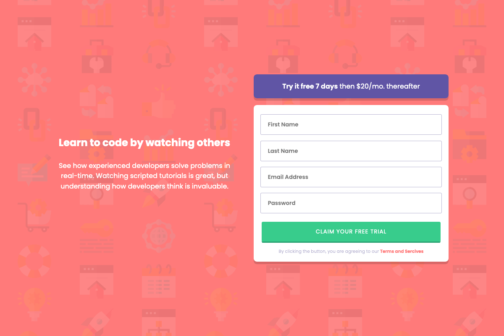
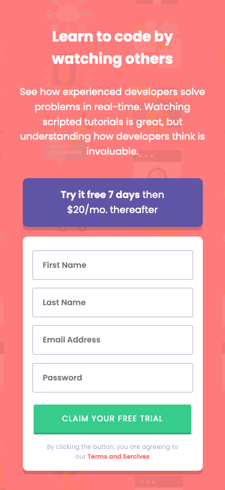

# Frontend Mentor - Intro component with sign up form solution

This is my solution to the [Intro component with sign up form challenge on Frontend Mentor](https://www.frontendmentor.io/challenges/intro-component-with-signup-form-5cf91bd49edda32581d28fd1). Frontend Mentor challenges help you improve your coding skills by building realistic projects. 

## Table of contents

- [Overview](#overview)
  - [The challenge](#the-challenge)
  - [Screenshot](#screenshot)
  - [Links](#links)
- [My process](#my-process)
  - [Built with](#built-with)
  - [What I learned](#what-i-learned)
  - [Useful resources](#useful-resources)
- [Author](#author)

## Overview

### The challenge

Users should be able to:

- View the optimal layout for the site depending on their device's screen size
- See hover states for all interactive elements on the page
- Receive an error message when the `form` is submitted if:
  - Any `input` field is empty. The message for this error should say *"[Field Name] cannot be empty"*
  - The email address is not formatted correctly (i.e. a correct email address should have this structure: `name@host.tld`). The message for this error should say *"Looks like this is not an email"*

### Screenshot

#### Desktop



#### Mobile



### Links

- Solution URL: https://www.frontendmentor.io/solutions/responsive-signup-form-built-with-react-lvKCi18HDZ
- Live Site URL: https://incredible-pegasus-1b4484.netlify.app/

## My process

### Built with

- Semantic HTML5 markup
- CSS custom properties
- Mobile-first workflow
- [React](https://reactjs.org/) - JS library

### What I learned

I worked on this challenge to practice my React skills, but I spent a significant amount of time learning how to customize the form validation to meet the challenge specifications. Below is an excerpt of the `validator` function from the `Form` component:

```javascript
    function validator(data, event) {
        let errors = {}
        const emailPattern = /^[a-zA-Z0-9._%+-]+@[a-zA-z0-9.-]+\.[a-zA-Z]{2,}$/

        if(data.firstName === '') {
            errors.firstName = 'First name cannot be empty'
            event.target.firstName.focus()
        }

        if(data.lastName === '') {
            errors.lastName = 'Last name cannot be empty'
            event.target.lastName.focus()
        }

        if(data.email === '') {
            errors.email = 'Email cannot be empty'
            event.target.email.focus()
        } else if (!emailPattern.test(data.email)) {
            errors.email = "Looks like that's not an email"
            event.target.email.focus()
        }

        if(data.password === '') {
            errors.password = 'Password cannot be empty'
            event.target.password.focus()
        }

        return errors
    }
```

In addition, to writing this above function I also had to learn how to integrate this with React. This meant creating a new variable to store in state for the error messages and using the `validator` function to help set the state when the form was not completed correctly. Here's an snippet of code for how I set up the state for this: 

```javascript
const [errorMessage, setErrorMessage] = React.useState({})

function handleSubmit(event) {
        event.preventDefault()
        setErrorMessage(validator(formData, event))
    }
``` 

### Useful resources

- [Form feedback with JavaScript](https://www.the-art-of-web.com/javascript/feedback-modal-window/) - This helped me with the JavaScript I needed to provide feedback when the form is incomplete.
- [Form Validation in React JS](https://youtu.be/U4w3kvYePFs) - This video tutorial was immensely helpful to me in setting up the form validation function `validator`. 

## Author

- <a href="mailto:msg.for.anthony.p6ht3@simplelogin.com?subject=Nice GitHub Project&body=Hey Anthony, I saw your GitHub project. Let's talk!">Email</a>
- [LinkedIn](https://linkedin.com/in/anthonynanfito)
- [Portfolio](https://ananfito.github.io)
- [Blog](https://ananfito.hashnode.dev)

## Acknowledgements 

Special thanks to Chamu in the [Frontend Mentor Discord community](https://discord.gg/UAfh3qzhYb) for giving me feedback on how to fix the form width issue I was having with this project. Much appreacited! 
